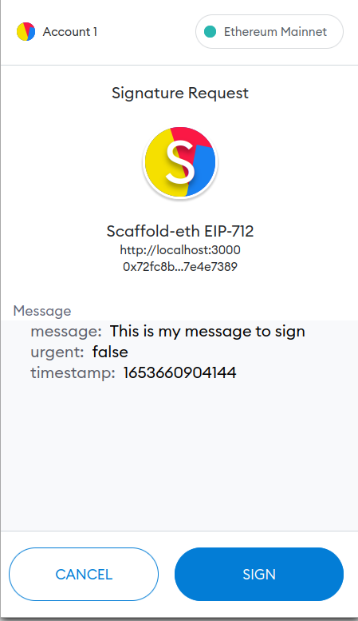
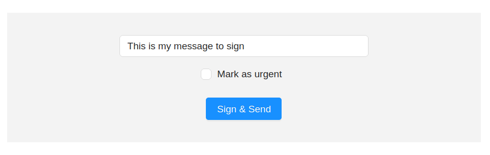
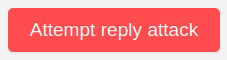

# 🏗 Scaffold-ETH - EIP712 signatures

Sign & verify using the [EIP712 standard](https://eips.ethereum.org/EIPS/eip-712). Built with 🏗 [Scaffold-ETH](https://github.com/scaffold-eth/scaffold-eth)



First, you'll sign a message:



You can find the front-end code in `packages/react-app/src/views/SignMessage.jsx`.

The signed message will be verified and stored by the back-end server. Check `packages/backend/index.js`

Once you send a valid signed message, you can attempt a replay attack:



## Getting started

Prerequisites: [Node (v16 LTS)](https://nodejs.org/en/download/) plus [Yarn](https://classic.yarnpkg.com/en/docs/install/) and [Git](https://git-scm.com/downloads)

> clone the repo:

```bash
git clone https://github.com/carletex/eip-712-signatures.git
```

> install dependencies and start the frontend:

```bash
cd eip-712-signatures
yarn install
yarn start
```

> in a second terminal window, start the backend server:

```bash
yarn backend
```

📱 Open http://localhost:3000 to see the app

---

## 📚 Documentation

Documentation, tutorials, challenges, and many more resources, visit: [docs.scaffoldeth.io](https://docs.scaffoldeth.io)


## 🍦 Other Flavors
- [scaffold-eth-typescript](https://github.com/scaffold-eth/scaffold-eth-typescript)
- [scaffold-nextjs](https://github.com/scaffold-eth/scaffold-eth/tree/scaffold-nextjs)
- [scaffold-chakra](https://github.com/scaffold-eth/scaffold-eth/tree/chakra-ui)
- [eth-hooks](https://github.com/scaffold-eth/eth-hooks)
- [eth-components](https://github.com/scaffold-eth/eth-components)
- [scaffold-eth-expo](https://github.com/scaffold-eth/scaffold-eth-expo)


## 🔭 Learning Solidity

📕 Read the docs: https://docs.soliditylang.org

📚 Go through each topic from [solidity by example](https://solidity-by-example.org) editing `YourContract.sol` in **🏗 scaffold-eth**

- [Primitive Data Types](https://solidity-by-example.org/primitives/)
- [Mappings](https://solidity-by-example.org/mapping/)
- [Structs](https://solidity-by-example.org/structs/)
- [Modifiers](https://solidity-by-example.org/function-modifier/)
- [Events](https://solidity-by-example.org/events/)
- [Inheritance](https://solidity-by-example.org/inheritance/)
- [Payable](https://solidity-by-example.org/payable/)
- [Fallback](https://solidity-by-example.org/fallback/)

📧 Learn the [Solidity globals and units](https://docs.soliditylang.org/en/latest/units-and-global-variables.html)

## 🛠 Buidl

Check out all the [active branches](https://github.com/scaffold-eth/scaffold-eth/branches/active), [open issues](https://github.com/scaffold-eth/scaffold-eth/issues), and join/fund the 🏰 [BuidlGuidl](https://BuidlGuidl.com)!
  
 - 🚤  [Follow the full Ethereum Speed Run](https://medium.com/@austin_48503/%EF%B8%8Fethereum-dev-speed-run-bd72bcba6a4c)

 - 🎟  [Create your first NFT](https://github.com/scaffold-eth/scaffold-eth/tree/simple-nft-example)
 - 🥩  [Build a staking smart contract](https://github.com/scaffold-eth/scaffold-eth/tree/challenge-1-decentralized-staking)
 - 🏵  [Deploy a token and vendor](https://github.com/scaffold-eth/scaffold-eth/tree/challenge-2-token-vendor)
 - 🎫  [Extend the NFT example to make a "buyer mints" marketplace](https://github.com/scaffold-eth/scaffold-eth/tree/buyer-mints-nft)
 - 🎲  [Learn about commit/reveal](https://github.com/scaffold-eth/scaffold-eth-examples/tree/commit-reveal-with-frontend)
 - ✍️  [Learn how ecrecover works](https://github.com/scaffold-eth/scaffold-eth-examples/tree/signature-recover)
 - 👩‍👩‍👧‍👧  [Build a multi-sig that uses off-chain signatures](https://github.com/scaffold-eth/scaffold-eth/tree/meta-multi-sig)
 - ⏳  [Extend the multi-sig to stream ETH](https://github.com/scaffold-eth/scaffold-eth/tree/streaming-meta-multi-sig)
 - ⚖️  [Learn how a simple DEX works](https://medium.com/@austin_48503/%EF%B8%8F-minimum-viable-exchange-d84f30bd0c90)
 - 🦍  [Ape into learning!](https://github.com/scaffold-eth/scaffold-eth/tree/aave-ape)


## 🏃💨 Speedrun Ethereum
Register as a builder [here](https://speedrunethereum.com) and start on some of the challenges and build a portfolio.

## 💬 Support Chat

Join the telegram [support chat 💬](https://t.me/joinchat/KByvmRe5wkR-8F_zz6AjpA) to ask questions and find others building with 🏗 scaffold-eth!

